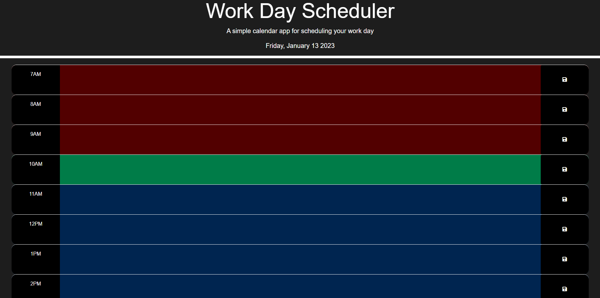

# Module-5

Third-Party APIs Challenge: Work Day Scheduler

## Description

A work day scheduler application that allows a user to save events for each hour of the day. This application displays for 12 hours (7AM - 7PM)

## User Story

- AS AN employee with a busy schedule
- I WANT to add important events to a daily planner
- SO THAT I can manage my time effectively

## Acceptance Criteria

- GIVEN I am using a daily planner to create a schedule
- WHEN I open the planner
- THEN the current day is displayed at the top of the calendar
- WHEN I scroll down
- THEN I am presented with time blocks for standard business hours
- WHEN I view the time blocks for that day
- THEN each time block is color-coded to indicate whether it is in the past, present, or future
- WHEN I click into a time block
- THEN I can enter an event
- WHEN I click the save button for that time block
- THEN the text for that event is saved in local storage
- WHEN I refresh the page
- THEN the saved events persist

## Usage

- This workday calendar display work hours of the day 7AM - 7PM.
- On the top of the page, the current day and date is displayed.
- Each time block is color coded to indicate whether it occurs in the past(red), present(green), or future(blue).
- Each time block has an input field and save button where users can store their schedule.
- Once it saved, it will store in their local storage.
     
## Website Demonstration

## Website Link

https://masynnay.github.io/Work-Day-Scheduler/